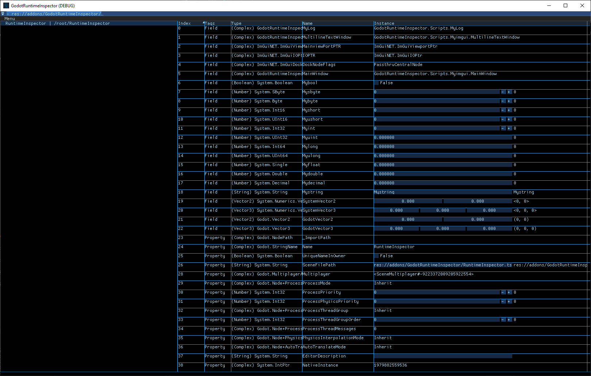

# GodotRuntimeInspector

A runtime inspector for the godot game engine.

I made this to learn about Godot Engine [1] and Dear ImGui [2].

The files here are a c# godot project, if you want to use it:

<code>

-) Create a C# solution (if you haven't already) for your project from, Project > Tools > C# > Create C# solution.

-) Open the solution and allow unsafe code, and install ImGui.NET [3] with NuGet.

-) Install imgui-godot [4], (copy the addons folder to your project).

-) Enable the imgui-godot plugin in Godot, Project > Project Settings > Plugins.

-) Copy the GodotRunTimeInspector folder from this repository to your project

-) Add GodotRunTimeInspector/Scripts/GodotRunTimeInspector.cs to a node in your Scene. 

or

-) The Scene GodotRunTimeInspector/GodotRuntimeInspector.tscn has a demo.
</code>

[1] https://github.com/godotengine/godot 

[2] https://github.com/ocornut/imgui 

[3] https://github.com/ImGuiNET/ImGui.NET

[4] https://github.com/pkdawson/imgui-godot 

