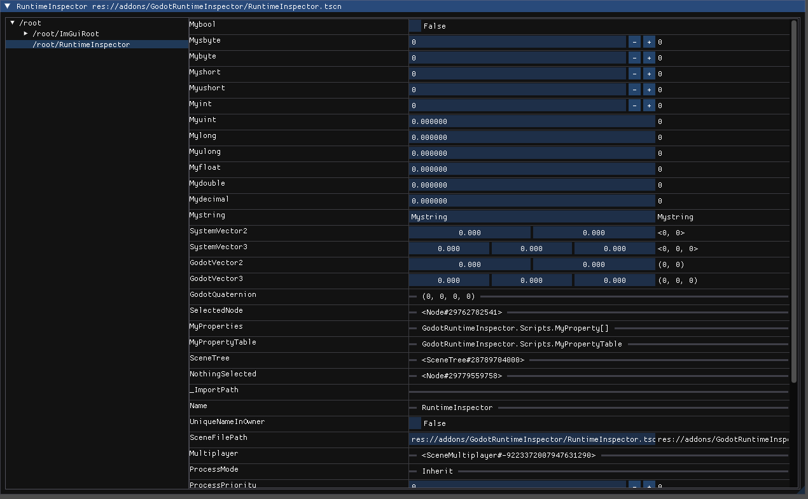

# GodotRuntimeInspector

View field, property and method information for scripts attached to Nodes in the Godot game engine.

    The files here are a c# godot project, if you want to use it:

<ul>
    <li>
    Create a C# solution (if you haven't already) for your project from, Project > Tools > C# > Create C# solution.
    </li>
    <li>
    Open the solution and allow unsafe code in your .csproj:  
    &lt;AllowUnsafeBlocks&gt;true&lt;/AllowUnsafeBlocks&gt;
    , and install ImGui.NET [3] with NuGet.
    </li>
    <li>
    Install imgui-godot [4], (copy the addons folder to your project).
    </li>
    <li>
    Enable the imgui-godot plugin in Godot, Project > Project Settings > Plugins.
    </li>
    <li>
    Copy addons/GodotRuntimeInspector from this repository to your project
    </li>
    <li>
    Drag the RuntimeInspector.tscn Node to your scene and run.
    </li>
</ul>

[1] https://github.com/godotengine/godot 

[2] https://github.com/ocornut/imgui 

[3] https://github.com/ImGuiNET/ImGui.NET

[4] https://github.com/pkdawson/imgui-godot 

